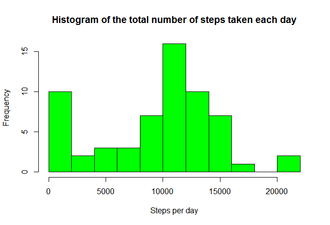
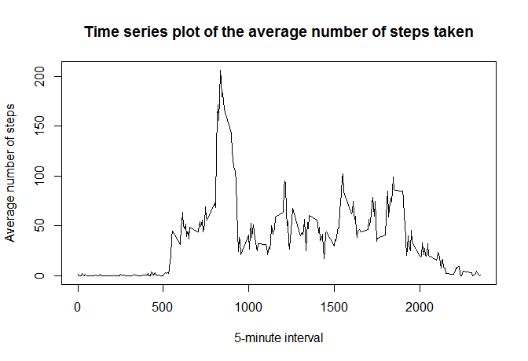
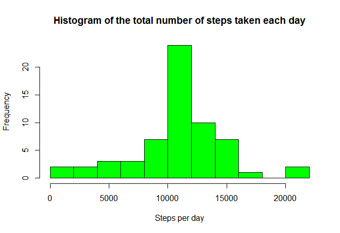
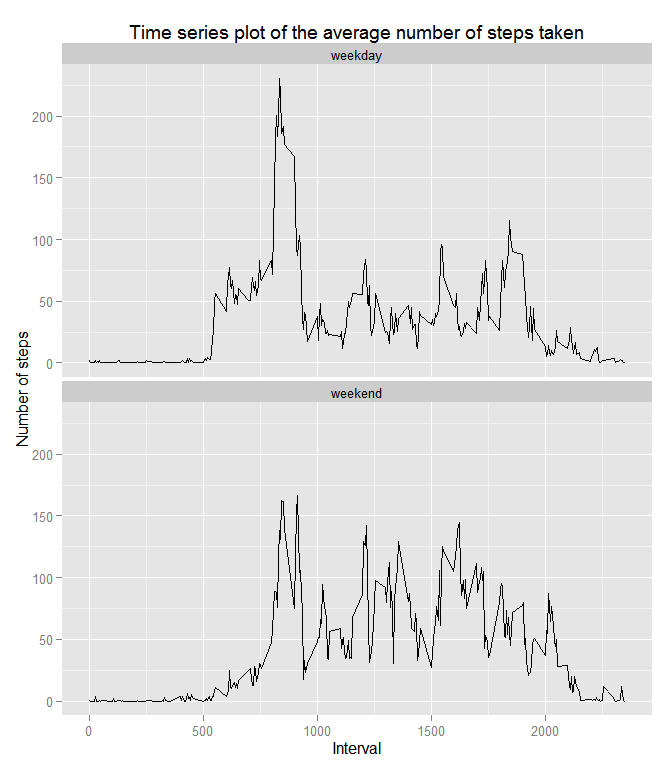

# Reproducible Research: Peer Assessment 1


## Loading and preprocessing the data
The code to load and preprocess the activity monitoring data is shown below.
As the `date` variable is a `factor` class, it is converted into a `date` class for convenience.


```r
activityData <- read.csv("activity.csv")
activityData$date <- as.Date(activityData$date, format="%Y-%m-%d")
```

## What is mean total number of steps taken per day?
The code to make a histogram of the total number of steps taken each day, and the historgram generated by it are shown below.


```r
## Calculate the total number of steps taken per day
library(reshape2)
sumActivity <- with(activityData, tapply(steps, date, sum, na.rm=TRUE))
stepsPerDay <- melt(sumActivity)
colnames(stepsPerDay) <- c("date", "steps")

## Make a histogram of the total number of steps taken each day
hist(stepsPerDay$steps, breaks=10, col="green", 
     xlab="Steps per day",
     main="Histogram of the total number of steps taken each day")
```



The code to calculate the **mean** and **median** total number of steps taken per day is shown below.


```r
meanSteps <- mean(stepsPerDay$steps, na.rm=TRUE)
meanSteps
```

```
## [1] 9354.23
```

```r
medianSteps <- median(stepsPerDay$steps, na.rm=TRUE)
medianSteps
```

```
## [1] 10395
```

The results are as follows:

 * The mean number of steps taken each day is 9354.2295082.
 * The median number of steps taken each day is 10395.

## What is the average daily activity pattern?
The code to make a time series plot of the 5-minute interval (x-axis) and the average number of steps taken, averaged across all days (y-axis), and a plot generated by it are shown below.


```r
meanActivity <- with(activityData, tapply(steps, interval, mean, na.rm=TRUE))
stepsPerInterval <- melt(meanActivity)
colnames(stepsPerInterval) <- c("interval", "steps")

plot(stepsPerInterval$interval, stepsPerInterval$steps, type="l",
     xlab="5-minute interval",
     ylab="Average number of steps",
     main="Time series plot of the average number of steps taken")
```



The code to get a 5-minute interval, on average across all the days in the dataset, which contains the maximum number of steps is shown below.


```r
maxSteps <- stepsPerInterval[which.max(stepsPerInterval$steps),]
maxSteps
```

```
##     interval    steps
## 104      835 206.1698
```

The result is the interval 835 which contains the maximum 206.1698113 steps.

## Imputing missing values
The code is to calculate the total number of missing values in the dataset is shown below.


```r
totalNAs <- sum(is.na(activityData$steps))
totalNAs
```

```
## [1] 2304
```

That is, the total number of missing steps is 2304.  

In order to fill in all of the missing values in the dataset, I use the mean for that 5-minute interval.
The variable `imputedData` is a new dataset that is equal to the original dataset but with the missing data filled in.
The code is shown below.


```r
imputedData <- activityData

## Fill in all of the missing values with the mean for that 5-minute interval
for (i in 1:nrow(imputedData)) {
    if (is.na(imputedData$steps[i])) {
        interval <- imputedData$interval[i]
        imputedData$steps[i] <- meanActivity[toString(interval)]
    }
}
```

The code to make a histogram of the total number of steps taken each day, and the historgram generated by it are shown below.


```r
## Calculate the total number of steps taken per day
sumActivity2 <- with(imputedData, tapply(steps, date, sum, na.rm=TRUE))
stepsPerDay2 <- melt(sumActivity2)
colnames(stepsPerDay2) <- c("date", "steps")

## Make a histogram of the total number of steps taken each day
hist(stepsPerDay2$steps, breaks=10, col="green", 
     xlab="Steps per day",
     main="Histogram of the total number of steps taken each day")
```



The code to calculate the **mean** and **median** total number of steps taken per day is shown below.


```r
meanSteps2 <- mean(stepsPerDay2$steps, na.rm=TRUE)
meanSteps2
```

```
## [1] 10766.19
```

```r
medianSteps2 <- median(stepsPerDay2$steps, na.rm=TRUE)
medianSteps2
```

```
## [1] 10766.19
```

The results are as follows:

 * The mean number of steps taken each day is 1.0766189\times 10^{4}.
 * The median number of steps taken each day is 1.0766189\times 10^{4}.

The strategy I chosed to impute:

 * increased the both mean and median number of steps.
 * decreased the smallest steps per day, that is, the leftmost bin of the histogram.

## Are there differences in activity patterns between weekdays and weekends?
The code to create a new factor variable `date_type` in the dataset with two levels - "weekday" and "weekend" indicating whether a given date is a weekday or weekend day is shown below.


```r
## In case if you use the locale other than English.
Sys.setlocale("LC_ALL","English")
```

```
## [1] "LC_COLLATE=English_United States.1252;LC_CTYPE=English_United States.1252;LC_MONETARY=English_United States.1252;LC_NUMERIC=C;LC_TIME=English_United States.1252"
```

```r
imputedData$date_type <- factor(ifelse(weekdays(imputedData$date, 
                                                abbreviate=TRUE) 
                                %in% c("Sat","Sun"), "weekend", "weekday"))
```

The code to make a panel plot containing a time series plot of the 5-minute interval (x-axis) and the average number of steps taken, averaged across all weekday days or weekend days (y-axis), and a panel plot generated by it are shown below. 


```r
## Get the average number of steps taken on weekdays.
meanWeekday <- with(imputedData[imputedData$date_type=="weekday",], 
                    tapply(steps, interval, mean, na.rm=TRUE))
meanWeekday2 <- melt(meanWeekday)
colnames(meanWeekday2) <- c("interval", "steps")
meanWeekday2$date_type <- "weekday"

## Get the average number of steps taken on weekends.
meanWeekend <- with(imputedData[imputedData$date_type=="weekend",], 
                    tapply(steps, interval, mean, na.rm=TRUE))
meanWeekend2 <- melt(meanWeekend)
colnames(meanWeekend2) <- c("interval", "steps")
meanWeekend2$date_type <- "weekend"

## Bind these two.
meanDateType <- rbind(meanWeekday2, meanWeekend2)

## Make a panel plot.
library(ggplot2)
q <- qplot(interval, steps, data=meanDateType, facets=date_type~., 
   geom="line", stat="identity", 
   xlab="Interval",
   ylab="Number of steps",
   main="Time series plot of the average number of steps taken")
q <- q + facet_wrap( ~date_type, ncol=1)
print(q)
```



This person's average number of steps of each interval are more even on weekends than on weekdays. 
